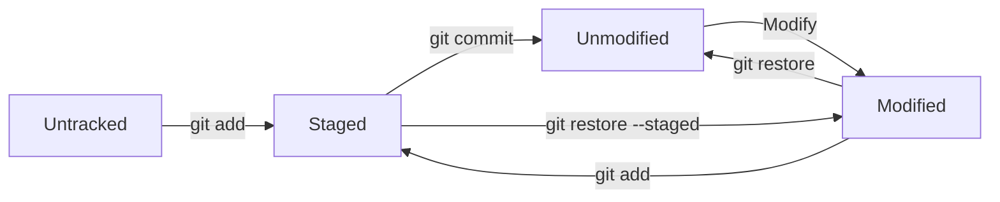

Manual do Github
---

### **MANUAL DO GIT HUB**  
*(Git e GitHub - Erros, Correções, Primeiros Passos, Boas Práticas e LFS)*  
## Exemplo: 
- primeiro subida ao repositório:
no terminal do vscode usando o CMD, vá para a pasta do projeto e :
endereço do projeto/ **git init**
endereço do projeto/**git remote add origin https://github.com/Gabriel-2040/Projeto_eleicoes_ETL.git**
####   Adicionando arquivos para subir para o github
####   Adicionando uma pasta
endereço do projeto/ **git add nome_da_pasta**
#### adicionando o arquivo gitignore
endereço do projeto/ **git add .gitignore**
git ignore é uma arquivo que contem os nomes dos arquivos que não vão para o repósiorio do git.(os ignorados, muito grandes ou sensiveis)
#### adicionando o arquivo readme.txt
endereço do projeto/**git add readme.txt**
#### Preparando o commit
aqui você avisa que vai fazer o primeiro commit e escreve uma mensagem sobre(obrigatório)
endereço do projeto/**git commit -m "meu primeiro commit"**
#### Escolhendo a branch que vai ser feita o commit
endereço do projeto/**git branch -M main**
#### Fazendo o upload para o github na branch main
endereço do projeto/**git push -u origin main**
#### Depois de fazer o primeiro commit e vai usar a mesma branch, para adicionar outras pastas ou arquivos só precisa desses 3 comandos: 
endereço do projeto/**git add _1_modelo_conceitual**
endereço do projeto/**git commit -m "adicionando pasta _1_modelo_conceitual"**
endereço do projeto/**git push origin main**

---

#### **1. PRIMEIROS PASSOS**  
1.1 **Instalação**  
- Windows/macOS/Linux: [git-scm.com/downloads](https://git-scm.com/downloads)  
1.2 **Configuração Inicial**  
  ```bash
  git config --global user.name "Seu Nome"
  git config --global user.email "seu@email.com"
  git config --global init.defaultBranch main  # Define branch padrão
  ```
1.3 **Exemplo de Primeiro Commit**  
```bash
# 1. Criar novo diretório e entrar nele
mkdir meu-projeto
cd meu-projeto

# 2. Inicializar repositório
git init

# 3. Criar arquivo README
echo "# Meu Projeto" >> README.md

# 4. Adicionar ao staging
git add README.md

# 5. Fazer primeiro commit
git commit -m "Primeiro commit: adiciona README inicial"

# 6. Adicionar repositório remoto (crie primeiro no GitHub)
git remote add origin https://github.com/usuario/meu-projeto.git

# 7. Enviar para o GitHub
git push -u origin main
```

#### **2. CONFIGURAÇÕES ESSENCIAIS**  
2.1 **`git remote`: Gerenciando Repositórios Remotos**  
O comando `git remote` permite conectar seu repositório local a servidores remotos (como GitHub):

```bash
# Adicionar novo repositório remoto
git remote add origin https://github.com/usuario/repo.git

# Listar conexões remotas configuradas
git remote -v

# Exemplo de saída:
# origin  https://github.com/usuario/repo.git (fetch)
# origin  https://github.com/usuario/repo.git (push)

# Alterar URL do remote
git remote set-url origin https://novaurl.com/repo.git

# Renomear remote
git remote rename origin novo-nome

# Remover conexão remota
git remote remove origin
```

2.2 **`.gitignore`: Controlando Arquivos Não Rastreados**  
Arquivo especial que define quais arquivos/diretórios o Git deve ignorar:

```bash
# Criar arquivo .gitignore na raiz do projeto
touch .gitignore
```

**Conteúdo típico (.gitignore):**
```gitignore
# Ignorar arquivos de ambiente
.env
*.env

# Ignorar diretórios de dependências
node_modules/
vendor/

# Ignorar arquivos de sistema
.DS_Store
Thumbs.db

# Ignorar arquivos compilados
*.class
*.exe
*.dll

# Ignorar logs
*.log
logs/
```

**Boas práticas:**
- Sempre crie o `.gitignore` no primeiro commit
- Use templates prontos: [github/gitignore](https://github.com/github/gitignore)
- Arquivos já rastreados precisam ser removidos:
  ```bash
  git rm --cached _6_python/api_cep_lat_long_Brazilcep.py
  ```
    ```bash
  git commit -m "Removendo arquivos do repositório agora ignorados pelo .gitignore"
  ```
      ```bash
	git commit -m "Removendo arquivos do repositório agora ignorados pelo .gitignore"
  ```
  ```bash
	git push origin main
  ```

---

#### **3. CICLO DE VIDA DOS ARQUIVOS NO GIT**  
3.1 **As 4 Áreas Fundamentais**  
- **Untracked**: Arquivo não rastreado (ex: novo arquivo)  
- **Unmodified**: Versionado sem modificações  
- **Modified**: Modificado desde último commit  
- **Staged**: Preparado para commit (`git add` aplicado)  

3.2 **Fluxo de Comandos**  


---

#### **4. OPERAÇÕES DIÁRIAS**  
4.1 **Verificação de Status**  
```bash
git status  # Mostra estado atual dos arquivos
```

4.2 **Comparação de Alterações**  
```bash
git diff             # Modificações não staged
git diff --staged    # Modificações staged
git diff HEAD~1      # Compara com último commit
```

4.3 **Correção de Erros**  
```bash
# Desfazer modificações não commitadas
git restore arquivo.txt

# Remover da área staged
git restore --staged arquivo.txt

# Reverter último commit (mantém alterações)
git reset --soft HEAD~1
```

---

#### **5. SINCRONIZAÇÃO COM REMOTO**  
5.1 **Fluxo Completo**  
```bash
# Baixar alterações remotas
git fetch origin

# Comparar com branch local
git diff origin/main

# Incorporar alterações
git pull origin main  # Equivale a git fetch + git merge

# Enviar alterações locais
git push -u origin main
```

5.2 **Resolvendo Conflitos**  
Quando ocorrerem mensagens como:
```
<<<<<<< HEAD
Seu código local
=======
Código remoto
>>>>>>> branch-remoto
```
1. Edite o arquivo manualmente
2. Remova os marcadores de conflito
3. Execute:
```bash
git add arquivo_conflitante
git commit -m "Resolve conflito"
```

---


Aqui estão as seções completas de **Reiniciando Repositório** e **Git LFS** conforme solicitado:

---

### **6. REINICIANDO UM REPOSITÓRIO**  
*(Quando você precisa começar do zero)*  

```bash
# 1. Remover completamente o histórico local
rm -rf .git  # Apaga diretório .git (cuidado: operação irreversível!)

# 2. Inicializar novo repositório
git init

# 3. Reconfigurar usuário (se necessário)
git config user.name "Novo Nome"
git config user.email "novo@email.com"

# 4. Adicionar arquivos essenciais
echo "# Reinício do Projeto" > README.md
echo "node_modules/" > .gitignore  # Criar/atualizar .gitignore

# 5. Fazer novo commit inicial
git add .
git commit -m "Commit inicial após reinício"

# 6. Reconectar ao repositório remoto
git remote add origin https://github.com/usuario/meu-projeto.git

# 7. Forçar push (substitui histórico remoto)
git push -f -u origin main

# ⚠️ ATENÇÃO: 
# - Isso apaga todo o histórico anterior do repositório remoto!
# - Notifique todos os colaboradores antes de executar
# - Ideal apenas para projetos pessoais ou início de novo módulo
```

---

### **7. GIT LFS (LARGE FILE STORAGE)**  

7.1 **O que é e quando usar**  
- Gerencia arquivos grandes (>100MB): binários, vídeos, datasets, modelos 3D  
- Armazena arquivos em servidor separado, mantendo apenas ponteiros no Git  
- Evita problemas de performance e limites do GitHub (arquivos >50MB bloqueiam push)

7.2 **Configuração Inicial**  
```bash
# Instalar LFS (uma vez por máquina)
git lfs install

# Especificar tipos de arquivos para rastrear
git lfs track "*.psd"
git lfs track "*.mp4"
git lfs track "*.zip"
git lfs track "data/*.bin"

# Verificar arquivos rastreados
git lfs track

# O comando acima gera/atualiza .gitattributes
git add .gitattributes
```

7.3 **Fluxo de Trabalho**  
```bash
# 1. Adicionar arquivos grandes (igual a arquivos normais)
git add video.mp4

# 2. Commit (cria ponteiro LFS)
git commit -m "Adiciona vídeo tutorial"

# 3. Push (envia arquivos para armazenamento LFS)
git push origin main

# 4. Clonar repositório com LFS
git lfs clone https://github.com/usuario/projeto-com-videos.git
```

7.4 **Comandos Avançados**  
```bash
# Verificar arquivos gerenciados pelo LFS
git lfs ls-files

# Migrar arquivos existentes para LFS
git lfs migrate import --include="*.mp4"

# Limpar cache de arquivos antigos
git lfs prune
```

7.5 **Boas Práticas**  
- Adicione `.gitattributes` ao versionamento  
- Especifique extensões exatas (`*.psd` em vez de `*.*`)  
- Para datasets grandes, use subdiretórios dedicados:  
  ```bash
  git lfs track "datasets/raw/**"
  ```
- Atualize o README.md indicando uso de LFS

---

### **Importante sobre Reinício + LFS**  
Se precisar reiniciar um repositório que usa LFS:
1. Repita os passos da seção 6  
2. Após o passo 4:  
```bash
# Reconfigurar LFS
git lfs install
git lfs track "*.extensao"  # Mesmos padrões anteriores
git add .gitattributes
```
3. Continue com commit e push forçado

Este conteúdo mantém a integridade do manual enquanto fornece as informações solicitadas de forma clara e prática. 😊

---

#### **8. WORKFLOW PROFISSIONAL**  
```bash
# 1. Atualizar repositório local
git checkout main
git pull --rebase origin main

# 2. Criar nova branch
git checkout -b feat/nova-funcionalidade

# 3. Desenvolver e commitar
git add .
git commit -m "feat: adiciona nova funcionalidade"

# 4. Publicar branch
git push -u origin feat/nova-funcionalidade

# 5. Abrir Pull Request no GitHub
# 6. Após aprovação e merge, limpar branch local
git branch -d feat/nova-funcionalidade
```
